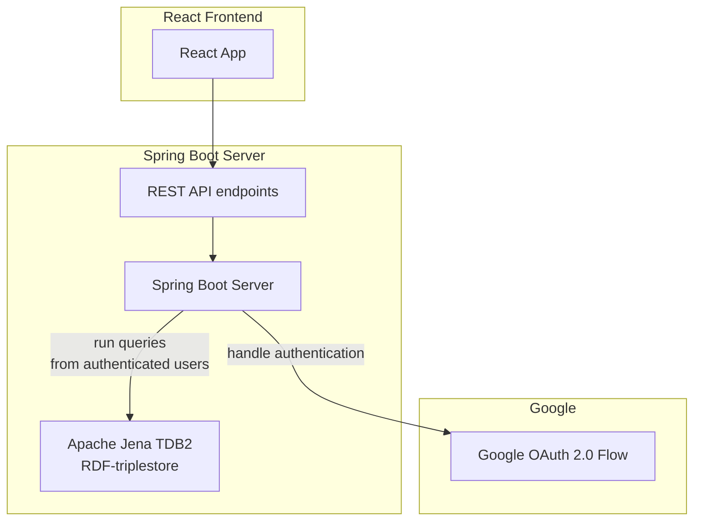
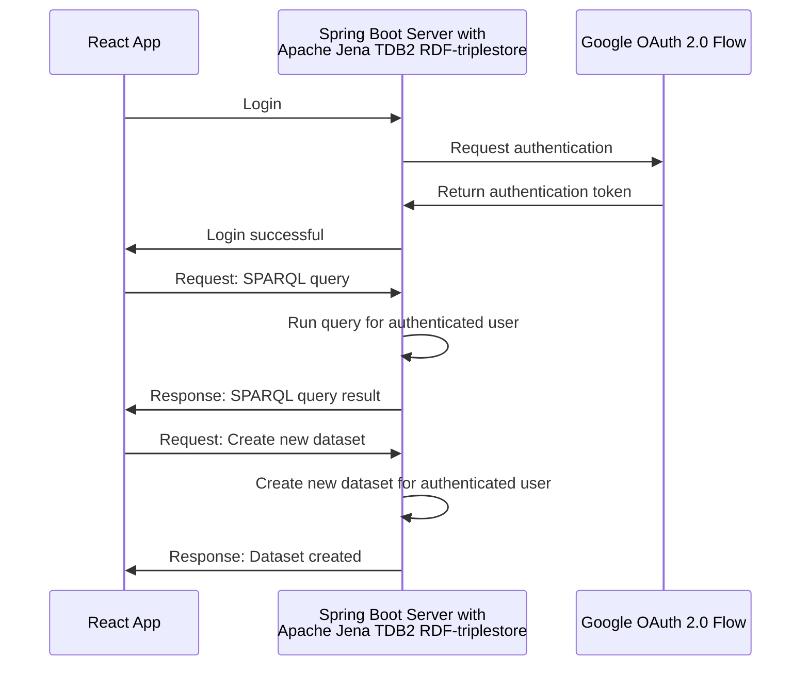

## Architecture overview

```mermaid
graph

  subgraph React Frontend
    reactApp[React App]
  end

  subgraph Spring Boot Server
    springBoot[Spring Boot Server]
    triplestore[Apache Jena TDB2<br>RDF-triplestore]
    restAPI[REST API endpoints]
    restAPI --> springBoot
    springBoot -->|run queries<br>from authenticated users| triplestore
  end

  subgraph Google
    googleAuth[Google OAuth 2.0 Flow]
  end

  reactApp --> restAPI
  springBoot -->|handle authentication| googleAuth
```

## Sequence diagram

```mermaid
sequenceDiagram
    participant R as React App
    participant ST as Spring Boot Server with<br>Apache Jena TDB2 RDF-triplestore
    participant G as Google OAuth 2.0 Flow

    R->>ST: Login
    ST->>G: Request authentication
    G->>ST: Return authentication token
    ST->>R: Login successful

    R->>ST: Request: SPARQL query
    ST->>ST: Run query for authenticated user
    ST->>R: Response: SPARQL query result

    R->>ST: Request: Create new dataset
    ST->>ST: Create new dataset for authenticated user
    ST->>R: Response: Dataset created
```
