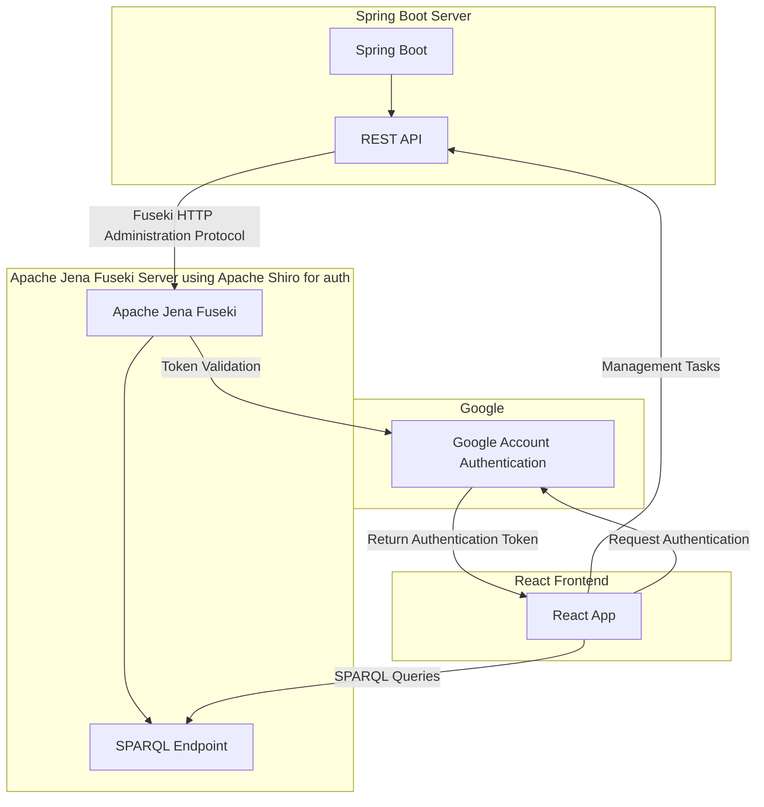
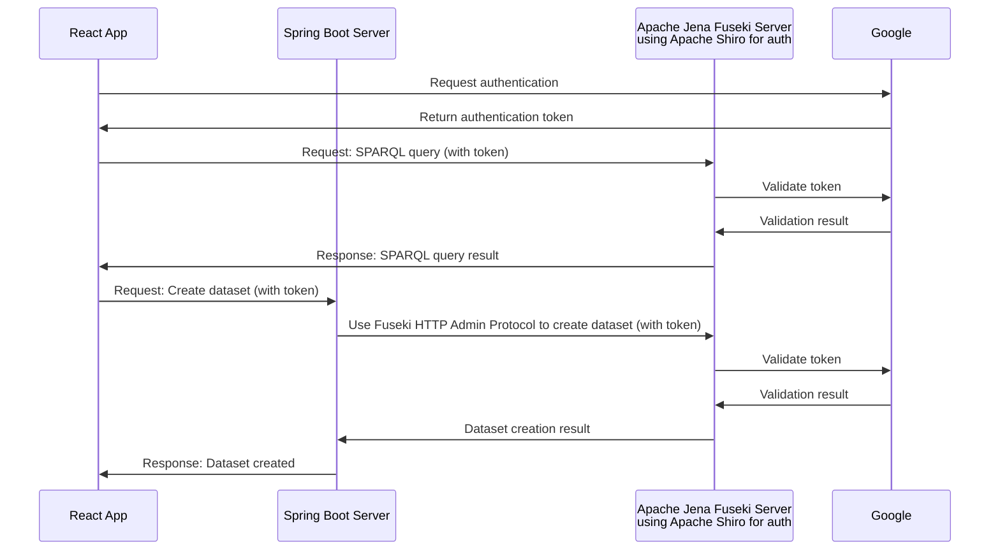

## Architecture overview

```mermaid
graph

  subgraph Spring Boot Server
    springBoot[Spring Boot]
    restAPI[REST API]
    springBoot --> restAPI
  end

  subgraph Apache Jena Fuseki Server using Apache Shiro for auth
    fuseki[Apache Jena Fuseki]
    sparqlEndpoint[SPARQL Endpoint]
    fuseki --> sparqlEndpoint
  end

  subgraph Google
    googleAuth[Google Account Authentication]
  end

  subgraph React Frontend
    reactApp[React App]
  end

  restAPI -->|Fuseki HTTP Administration Protocol| fuseki
  reactApp -->|Management Tasks| restAPI
  reactApp -->|SPARQL Queries| sparqlEndpoint
  reactApp -->|Request Authentication| googleAuth
  googleAuth -->|Return Authentication Token| reactApp
  fuseki -->|Token Validation| googleAuth
```

## Sequence diagram

```mermaid
sequenceDiagram
    participant R as React App
    participant S as Spring Boot Server
    participant FS as Apache Jena Fuseki Server<br>using Apache Shiro for auth
    participant G as Google

    R->>G: Request authentication
    G->>R: Return authentication token

    R->>FS: Request: SPARQL query (with token)
    FS->>G: Validate token
    G->>FS: Validation result
    FS->>R: Response: SPARQL query result

    R->>S: Request: Create dataset (with token)
    S->>FS: Use Fuseki HTTP Admin Protocol to create dataset (with token)
    FS->>G: Validate token
    G->>FS: Validation result
    FS->>S: Dataset creation result
    S->>R: Response: Dataset created
```
