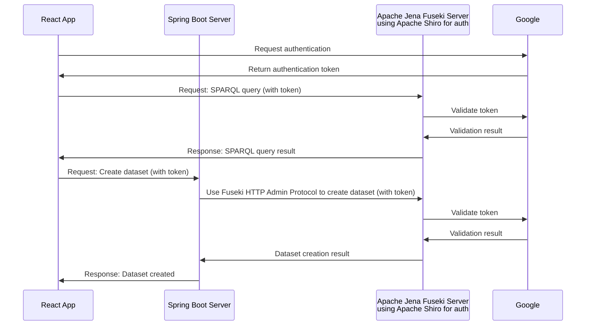

### Sequence diagram

```mermaid
sequenceDiagram
    participant R as React App
    participant S as Spring Boot Server
    participant FS as Apache Jena Fuseki Server<br>using Apache Shiro for auth
    participant G as Google

    R->>G: Request authentication
    G->>R: Return authentication token

    R->>FS: Request: SPARQL query (with token)
    FS->>G: Validate token
    G->>FS: Validation result
    FS->>R: Response: SPARQL query result

    R->>S: Request: Create dataset (with token)
    S->>FS: Use Fuseki HTTP Admin Protocol to create dataset (with token)
    FS->>G: Validate token
    G->>FS: Validation result
    FS->>S: Dataset creation result
    S->>R: Response: Dataset created
```
